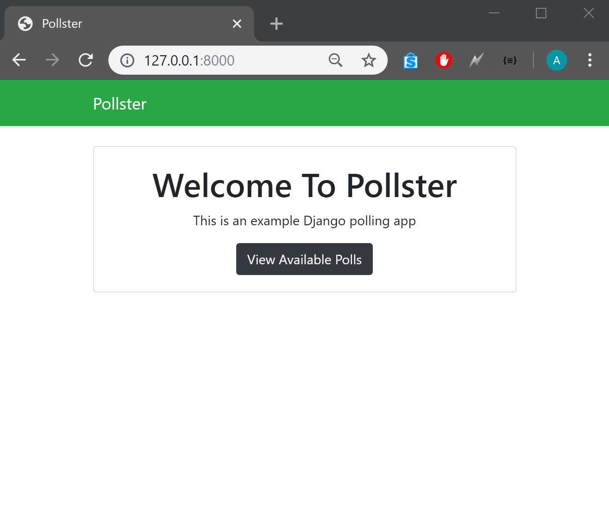
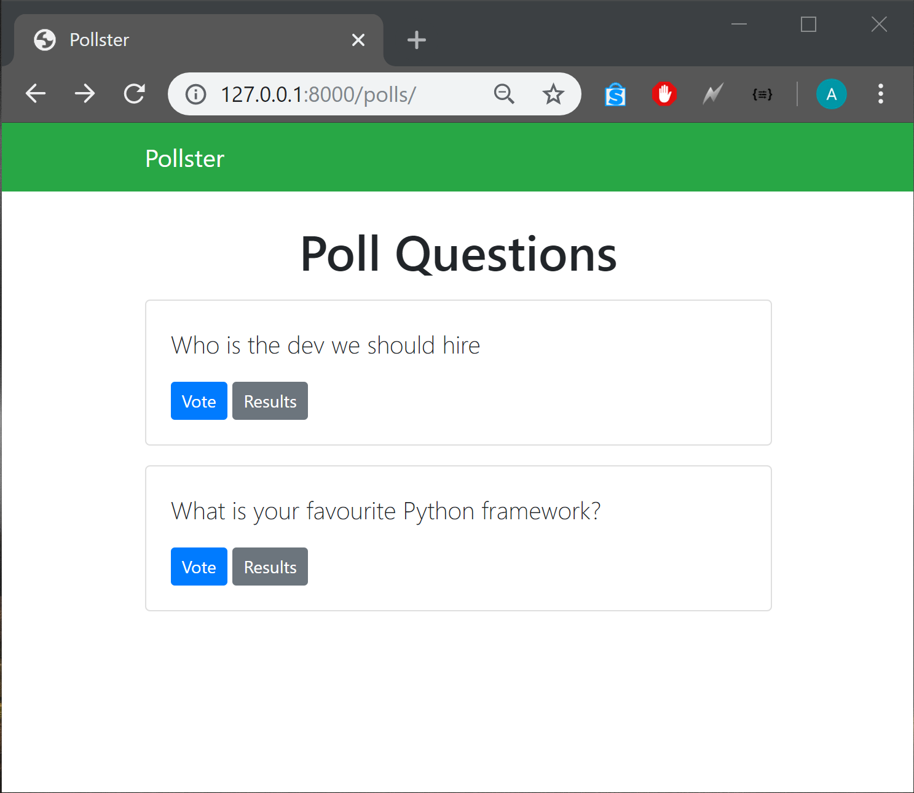
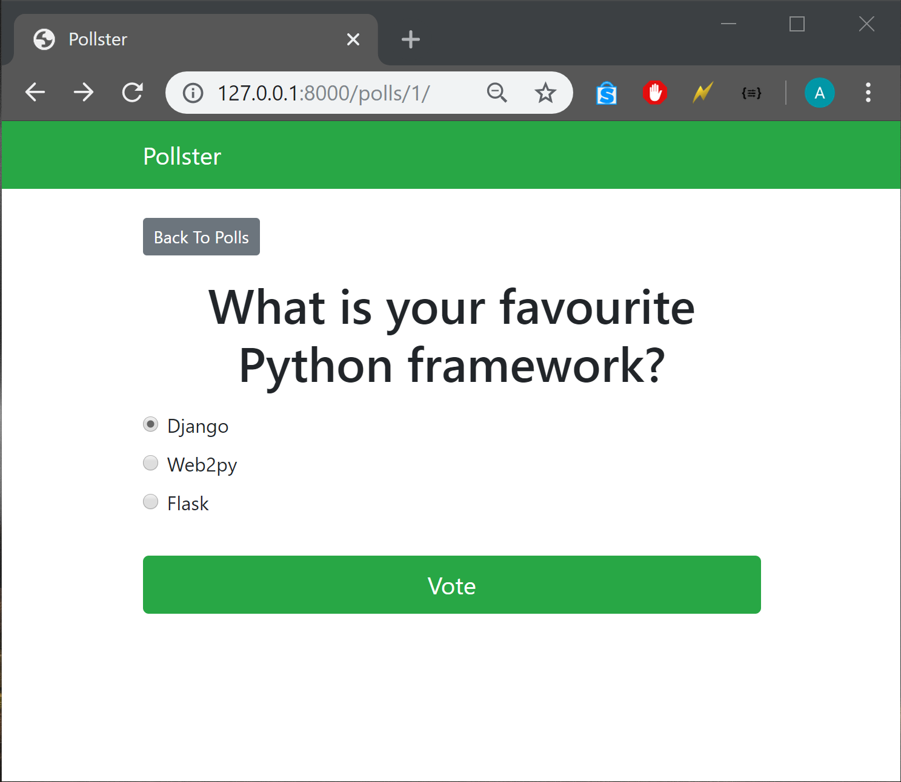
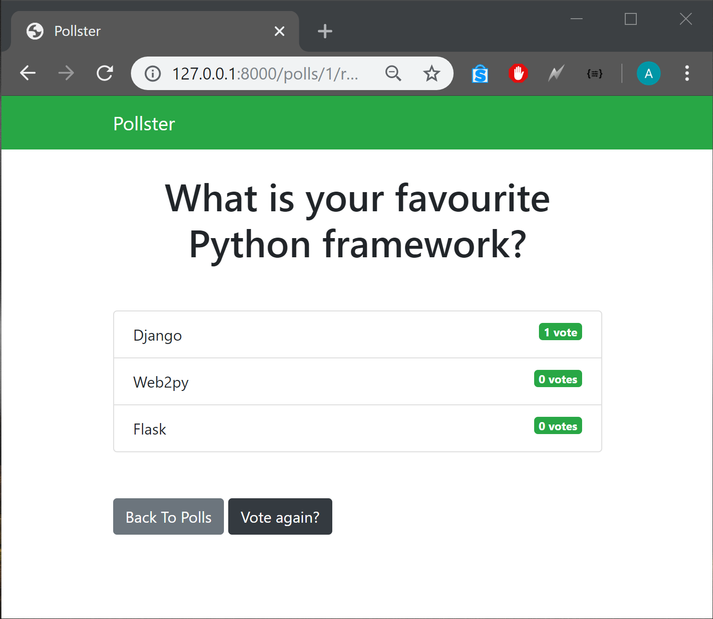
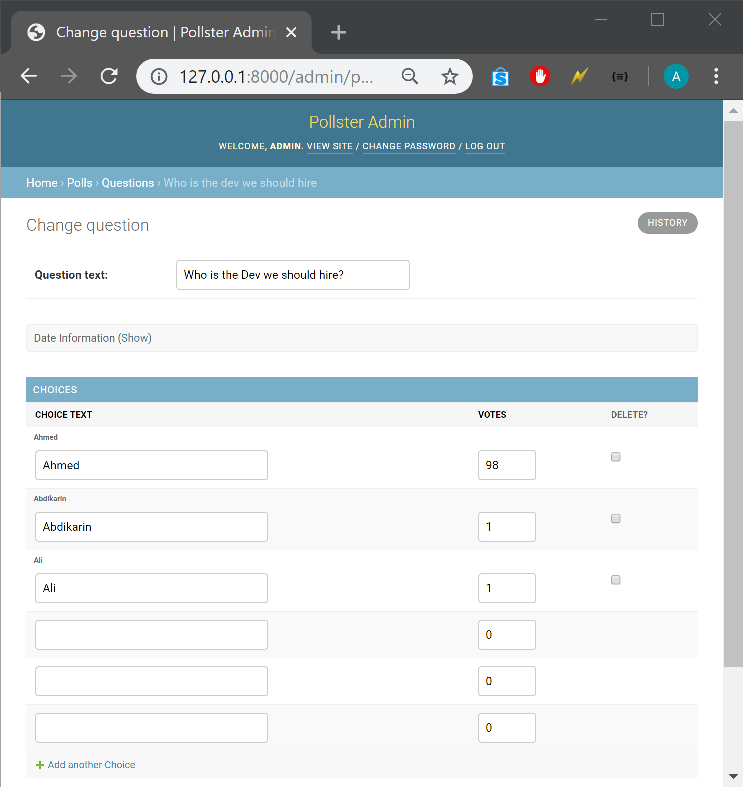
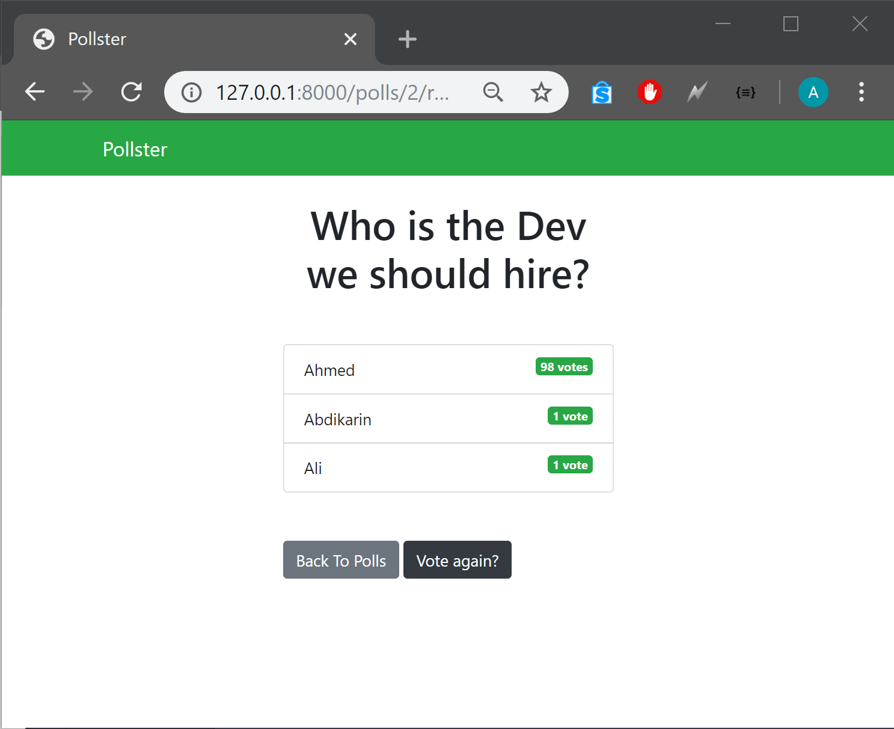

# Python-Polling-App
Python polling app using the Django framework
### To run project do the following

 run: <strong>  pipenv install </strong> to install dependencies 

 cd pollster 

 run: <strong> python manage.py runserver </strong>
<h2> Demo pictures</h2>

